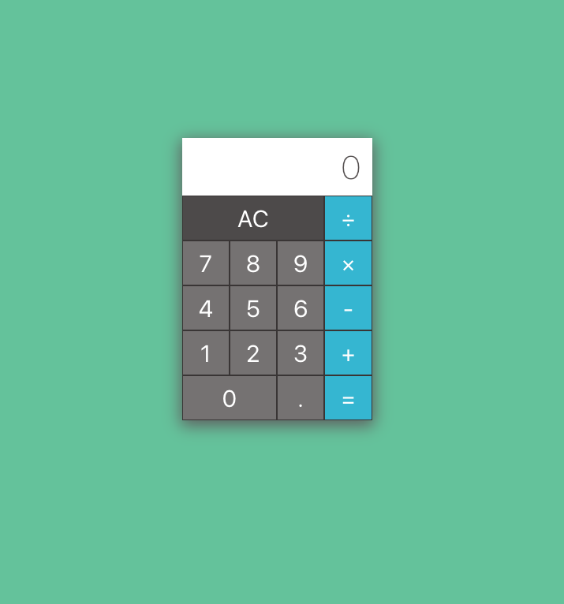

# Simple calculator

## Getting started

- Clone the repository
- Run `yarn install`
- Run `yarn start`
- The app should be visible in http://localhost:3000

## Tech structure

- Initial app scaffolding is done using `create-react-app`.
- The calculator stores state in the container component `currentNumber` `currentOperator` `cachedNumber` `cachedOperator` `shouldResetDisplay` [Calculator.jsx](./src/components/calculator/Calculator.jsx).
- The logic when number button is clicked is located in [NumberPanel.jsx](./src/components/calculator/NumberPanel.jsx).
  - When button is pressed depending on the `shouldResetDisplay` state, it updates display of the calculator.
  - It handles `0` and `.`.
- The logic when operator button is clicked is located in [OperatorPanel.jsx](./src/components/calculator/OperatorPanel.jsx).
  - When `equals` button is pressed, it updates the result and caches the last operator and number.
  - When `operators` button is pressed, it updates the result and updates cached value.

## Testing

Unit tests have been added using `jest`.

- Run `yarn test` to run test.
